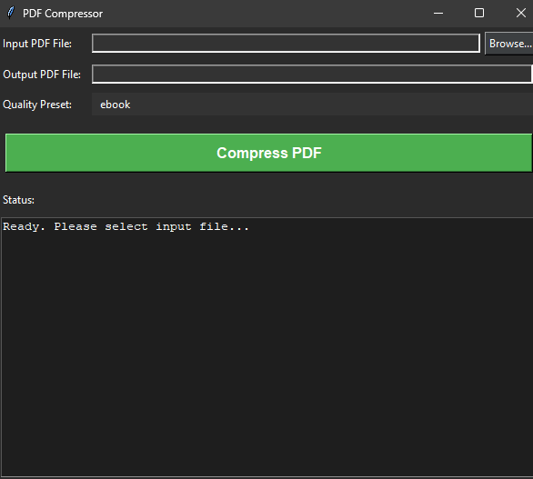

# PDF Compressor GUI

A simple graphical user interface (GUI) application built with Python and Tkinter to compress PDF files using Ghostscript. This tool helps reduce the file size of PDFs, especially those containing images, by leveraging Ghostscript's powerful optimization capabilities.



## Features

-   **User-friendly GUI:** Easy-to-use interface for selecting files and options.
-   **Ghostscript Powered:** Utilizes the robust Ghostscript engine for effective PDF compression.
-   **Quality Presets:** Choose from standard Ghostscript presets (`screen`, `ebook`, `printer`, `prepress`, `default`) to balance file size and quality.
-   **Automatic Output Naming:** Suggests an output filename with a `_compressed` suffix.
-   **Dark Theme:** A visually appealing dark mode interface.
-   **Status Updates:** Provides real-time feedback on the compression process.
-   **Cross-Platform (with Ghostscript):** The Python script itself is cross-platform, but Ghostscript needs to be installed appropriately for your OS.
-   **Robust Ghostscript Detection:** Attempts to find Ghostscript in the system PATH and common installation directories (primarily for Windows).

## Prerequisites

1.  **Python 3.10:** Ensure you have Python 3.10 installed. You can download it from [python.org](https://www.python.org/).
2.  **Ghostscript:** This application **requires** Ghostscript to be installed on your system.
    *   Download Ghostscript from: [ghostscript.com/releases/gsdnld.html](https://www.ghostscript.com/releases/gsdnld.html)
    *   During installation, it's recommended to allow Ghostscript to add its `bin` directory to your system's PATH environment variable. If not, the application will attempt to find it in common installation locations (e.g., `C:\Program Files\gs\` on Windows).

## Installation & Setup

1.  **Clone the repository or download the script:**
    ```bash
    # If using Git
    git clone <repository_url>
    cd <repository_directory>
    ```
    Or simply download the Python script (`your_script_name.py`).

2.  **Python Dependencies:**
    This script primarily uses Python's built-in libraries (`tkinter`, `os`, `shutil`, `subprocess`, `threading`, `glob`). No external Python packages are strictly required to be installed via pip for the core functionality.

## How to Run

1.  Ensure **Python 3** and **Ghostscript** are installed as per the prerequisites.
2.  Open a terminal or command prompt.
3.  Navigate to the directory where you saved the Python script.
4.  Run the script:
    ```bash
    python your_script_name.py
    ```
    (Replace `your_script_name.py` with the actual name of your Python file).

## Usage

1.  **Launch the Application:** Run the script as described above.
2.  **Select Input PDF:**
    *   Click the "Browse..." button next to "Input PDF File".
    *   Choose the PDF file you want to compress.
3.  **Output PDF File:**
    *   The application will automatically suggest an output filename in the same directory as the input, with `_compressed` appended (e.g., `mydoc_compressed.pdf`).
    *   You can change this by manually typing a path or by clicking the "Browse..." button next to "Output PDF File" (which functions as a "Save As..." dialog).
    *   **Caution:** Avoid setting the input and output file to be the same, as this would overwrite your original file. The application will warn you if you attempt this.
4.  **Select Quality Preset:**
    *   Choose a compression quality from the dropdown menu:
        *   `screen`: Lower quality, smallest size (e.g., 72 DPI images). Good for on-screen viewing where size is critical.
        *   `ebook`: Medium quality, good compression (e.g., 150 DPI images). A good balance for most documents.
        *   `printer`: Higher quality, larger size (e.g., 300 DPI images). For documents intended for printing.
        *   `prepress`: Highest quality, largest size. For professional printing, preserves color profiles, etc.
        *   `default`: Ghostscript's default setting, often similar to `screen` or `ebook`.
5.  **Compress:**
    *   Click the "Compress PDF" button.
6.  **Monitor Status:**
    *   The "Status" area at the bottom will display progress, including the Ghostscript command being executed, original and compressed file sizes, and the percentage reduction.
    *   A message box will appear upon success or failure.

## Troubleshooting

*   **"Ghostscript Not Found" error:**
    *   Ensure Ghostscript is installed correctly.
    *   Verify that the `bin` directory of your Ghostscript installation (e.g., `C:\Program Files\gs\gs10.0x.x\bin`) is in your system's PATH environment variable.
    *   Alternatively, ensure Ghostscript is installed in a standard location like `C:\Program Files\gs\`.
    *   You might need to restart your terminal or system after modifying the PATH.
*   **Compression fails or produces an empty file:**
    *   Check the "Status" area for specific error messages from Ghostscript.
    *   The input PDF might be corrupted or password-protected in a way Ghostscript cannot handle.
    *   Try a different quality preset.

## Contributing

Feel free to fork the project, make improvements, and submit pull requests.

## License

This project is licensed under the MIT License - see the [LICENSE](LICENSE) file for details.